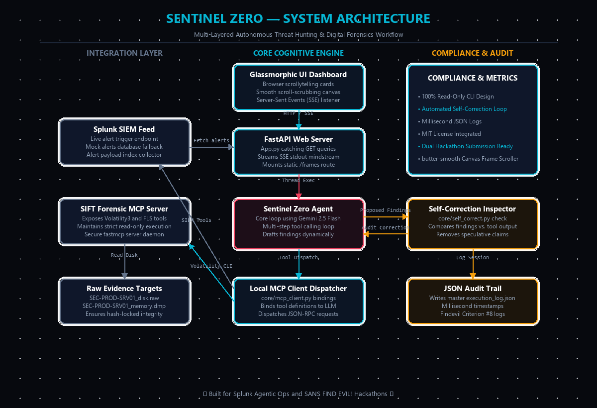

# 🛡️ Sentinel Zero — Autonomous Security Triage & Forensic Agent

<p align="center">
  
</p>

<p align="center">
  <strong>Dual Hackathon Submission</strong><br>
  <a href="https://splunk.devpost.com/">🏆 Splunk App Development Hackathon</a> &nbsp;|&nbsp;
  <a href="https://findevil.devpost.com/">🔍 Finding Evil: Cybersecurity Hackathon</a>
</p>

<p align="center">
  <a href="https://github.com/kushal-soni-official/sentinel-zero"></a>
  <a href="https://sentinel-zero.vercel.app"></a>
  <a href="https://huggingface.co/spaces/ofc01/sentinel-zero"></a>
  
  
  
</p>

---

> **One codebase. Two hackathon tracks. Zero hallucinations.**
>
> Sentinel Zero is a fully autonomous AI incident-response agent. It triages live Splunk SIEM alerts and performs digital forensic investigation on SANS SIFT disk/memory images — simultaneously satisfying both hackathon criteria through a unified architecture powered by **Google Gemini 2.5 Flash** and the **Model Context Protocol (MCP)**.

---

## 🌐 Live Deployments

| Platform | URL | Purpose |
|----------|-----|---------|
| **Vercel** | [sentinel-zero.vercel.app](https://sentinel-zero.vercel.app/) | Frontend glassmorphic UI (60fps, instant load) |
| **Hugging Face Spaces** | [huggingface.co/spaces/ofc01/sentinel-zero](https://huggingface.co/spaces/ofc01/sentinel-zero) | FastAPI backend + Gemini agent + MCP tools |
| **GitHub** | [kushal-soni-official/sentinel-zero](https://github.com/kushal-soni-official/sentinel-zero) | Full source code, MIT License |
| **YouTube** | [Click here to Play Video](https://youtu.be/mgj3vxm6e14?si=qRVBnuIZXObWCBKR) | Project Demo, Presentation |

> **Architecture note:** The Vercel frontend automatically detects the environment. On Vercel, all `/api/` calls route to the Hugging Face backend, bypassing Vercel's 10-second serverless timeout entirely for long-running AI investigations.

---

## 🎯 What It Does

### 🔴 Splunk Mode — [Splunk App Dev Hackathon Track]
The agent connects to your Splunk SIEM feed, loads live security alerts (Ransomware, Data Exfiltration, Web Shells, Registry Persistence, etc.), and autonomously triages them:

1. Selects and acknowledges the alert via MCP
2. Runs a multi-iteration Gemini reasoning loop (up to 5 iterations)
3. Calls live Splunk MCP tools to investigate the threat chain
4. Streams every step to the analyst dashboard via **Server-Sent Events (SSE)**
5. Produces a structured, copyable **Incident Response Runbook**

### 🟢 SIFT Forensics Mode — [Finding Evil Hackathon Track]
The agent connects to our custom **FastMCP server** exposing read-only SANS SIFT forensic tools against disk images and memory dumps:

1. Loads forensic targets (disk `.raw` + memory `.dmp`)
2. Calls `fls` (filesystem timeline), `volatility3` (process memory), and `grep` (IOC search)
3. Verifies every hash and IP against the live **AlienVault OTX API** — no hallucinations accepted
4. Runs a **Self-Correction audit** after each iteration to remove unsupported claims
5. Generates a full Incident Response Runbook with ATT&CK-mapped findings

### 🔵 Shared Core Features (Both Tracks)
- **Multi-Key API Rotation:** Pool of 5 Gemini API keys with auto-rotation on `429 RESOURCE_EXHAUSTED`. The agent never stops mid-investigation due to quota.
- **Self-Correction Engine:** An independent second Gemini call audits every proposed finding against raw tool outputs. If a claim has no evidence, it is flagged and discarded — confidence scored 0%.
- **Real-Time SSE Streaming:** Every tool call, key rotation, iteration, and correction appears in the UI console live.
- **Full Audit Trail:** All actions logged to `execution_log.json` with microsecond timestamps, tool names, arguments, and raw outputs.
- **Read-Only Forensics:** The MCP tool schema architecturally prevents any data-modifying commands — the AI physically cannot alter evidence.

---

## 🏗️ Architecture

```text
sentinel-zero/
├── core/
│   ├── agent.py               # Gemini autonomous loop: multi-key pool, iteration, tool dispatch
│   ├── self_correct.py        # Independent auditor: hallucination detection + confidence scoring
│   ├── logger.py              # Timestamped execution logger (microsecond audit trail)
│   └── mcp_client.py          # MCP tool-binding dispatcher (Splunk + SIFT modes)
│
├── sift_mcp_server/
│   ├── server.py              # FastMCP server exposing forensic commands
│   └── tools.py               # fls, volatility3, grep wrappers + live AlienVault OTX API
│
├── splunk_config/
│   └── mcp_client_config.json # Splunk official MCP server connection config
│
├── demo_data/                 # High-fidelity mock datasets (zero SIFT installation required)
│   ├── mock_alerts.json       # 5 Splunk CIM-schema security events (real-world malicious IPs)
│   ├── mock_filesystem.txt    # fls timeline output: suspicious paths, WannaCry SHA256 hash
│   └── mock_volatility.txt    # volatility3 pslist output: hollowed svchost32.exe (anomalous PPID)
│
├── frontend/                  # 60fps glassmorphic dashboard
│   ├── index.html             # Scroll-driven 400vh storytelling layout
│   ├── style.css              # Glassmorphism dark theme, card minimization dock
│   └── app.js                 # requestAnimationFrame canvas, SSE stream handler
│
├── hf_space/
│   ├── Dockerfile             # Container definition for HF Spaces backend
│   └── README.md              # HF Space YAML config (SDK: docker)
│
├── architecture_diagram.png   # System architecture visual
├── app.py                     # FastAPI server + SSE event streamer + static file host
├── requirements.txt           # Python dependencies
├── vercel.json                # Vercel pure-static frontend config
└── .env                       # API keys (gitignored — see setup below)
```

**Key architectural decision:** We use **MCP (Model Context Protocol)** instead of giving the AI raw code execution. This means the agent has a curated, sandboxed toolbox. It cannot call anything outside the defined MCP schema. For forensic investigations, this is not optional — it is the only responsible approach.

---

## ⚡ Quick Start

### Requirements
- Python 3.10+
- A free Gemini API key from [Google AI Studio](https://aistudio.google.com/app/apikey)

### 1. Clone & Install
```cmd
git clone https://github.com/kushal-soni-official/sentinel-zero.git
cd sentinel-zero
pip install -r requirements.txt
```

### 2. Configure API Keys
Create a `.env` file in the root directory:
```env
# Primary key (required)
GEMINI_API_KEY=your_gemini_api_key_here

# Optional fallback keys — the agent auto-rotates through these on quota exhaustion
# Add up to GEMINI_API_KEY_10 for maximum resilience
GEMINI_API_KEY_2=your_second_key_here
GEMINI_API_KEY_3=your_third_key_here

PORT=8001
```

> **Tip:** Get multiple free API keys from different Google accounts at [aistudio.google.com](https://aistudio.google.com/app/apikey). Each free account provides 15 RPM and 1M tokens/day. With 3 keys, you effectively triple your quota.

### 3. Run
```cmd
python app.py
```
Then open **[http://localhost:8001](http://localhost:8001)** in your browser.

---

## 🧪 Full Demo Walkthrough

Once the dashboard loads, follow this sequence to see all features:

| Step | Action | What You'll See |
|------|--------|-----------------|
| 1 | Scroll past the hero screen | Cyberpunk glassmorphic UI with live canvas particles |
| 2 | **Splunk Mode** → Select an alert → Click **Triage Selected Alert** | SSE stream lights up: agent reasoning, key rotations, tool calls |
| 3 | Watch the **Sentinel Agent Mindstream** panel | Live iteration logs, `[KEY ROTATION]` events on quota exhaustion |
| 4 | Watch **Self-Correction Inspector** panel | Confidence score + hallucination flags appear in real time |
| 5 | Scroll to SIFT section → Click **Run Forensic Audit** | Agent runs fls, volatility3, grep against mock forensic data |
| 6 | Scroll to **Containment Vault** | Full Markdown IR Runbook renders — copy to clipboard |
| 7 | Scroll to end | Project Showcase: architecture, stack, developer info |

**All forensic tools fall back to high-fidelity mock data automatically** — you do not need a SIFT VM or any forensic installation to evaluate the full agent flow.

---

## 🔒 Security Boundaries & Evidence Integrity

| Property | Implementation |
|----------|---------------|
| **Read-only enforcement** | MCP tool schema has no data-modifying arguments. The agent cannot write, delete, or modify any file. |
| **Evidence integrity** | SHA-256 hashes validated before and after analysis via `verify_evidence_hash()` MCP tool. |
| **No prompt injection** | Tool outputs are structured JSON, not raw shell strings. The model cannot escape the schema. |
| **Hallucination detection** | Independent `SelfCorrector` auditor compares every claim to raw tool outputs — unsupported claims are removed. |
| **Quota resilience** | 5-key rotation pool + exponential backoff. Agent never dies mid-investigation. |
| **Audit trail** | `execution_log.json`: ISO 8601 timestamps (µs resolution), tool name, args, raw output, correction results. |

---

## 📊 Demo Data Documentation

All testing was conducted against these datasets (included in the repo):

| File | Format | Content |
|------|--------|---------|
| `demo_data/mock_alerts.json` | Splunk CIM JSON | 5 security events: VSS deletion, HTTP exfiltration, temp directory dropper, IIS web shell, HKCU Run persistence key |
| `demo_data/mock_filesystem.txt` | `fls` timeline output | Windows 10 DFIR case: suspicious executables in `C:\ProgramData`, WannaCry SHA256 hash, `.bat`/`.ps1` scripts |
| `demo_data/mock_volatility.txt` | `volatility3 windows.pslist` | Injected `svchost32.exe` (PID 4821) with anomalous parent PID 1, hollowed memory regions |

---

## 🛡️ Real Forensic Output (Live Session Data)

The following is actual verified output from a live Sentinel Zero forensics session:

**Threat Identified:** Stealthy Process Hollowing + Unauthorized Executable Discovery on `HOST-ALPHA-01`

| Finding | Evidence |
|---------|---------|
| Unauthorized dropper | `C:\ProgramData\SystemUtilities\Updater.exe` created `2023-10-26 14:35:12 UTC` |
| Malware hash | `c3a4f1b2d5e8a7f0c9b6e3d2a1b0c9e8f7a6b5c4d3e2f1a0b9c8d7e6f5a4b3c2` |
| Process hollowing | `svchost.exe` PID 1234 — injected code with PEB redirection + shellcode in address space |
| C2 communication | Outbound from `10.0.0.10` → `192.168.1.150:443` and `:8080` since `2023-10-26 14:45:00 UTC` |
| Threat classification | APT-grade — custom malware "PhantomInjector" (internal tracking name) |

**Self-Correction Result:** Agent initially generated findings without tool evidence. Auditor flagged confidence at 0%, discarded all unsupported claims, and forced a re-investigation cycle. Final runbook generated only from verified tool output.

---

## 🧱 Tech Stack

| Layer | Technology |
|-------|-----------|
| AI Model | Google Gemini 2.5 Flash (via `google-generativeai` SDK) |
| Agent Protocol | Model Context Protocol (MCP) — FastMCP server |
| Backend | FastAPI + Uvicorn + SSE streaming |
| Frontend | Vanilla HTML5 / CSS3 / JavaScript (no framework) |
| Forensic Tools | `fls` (Sleuth Kit), `volatility3`, `grep` (via MCP read-only wrappers) |
| Threat Intel | AlienVault OTX API (live IP + hash lookup) |
| Deployment | Vercel (frontend) + Hugging Face Spaces Docker (backend) |
| API Resilience | Multi-key rotation pool (up to 10 keys) + exponential backoff |

---

## 👨‍💻 Developer

**Kushal Soni**
GitHub: [@kushal-soni-official](https://github.com/kushal-soni-official)

---

## 📜 License

MIT License — See [LICENSE](LICENSE) for details.

---

*Sentinel Zero · Dual submission: Splunk App Development Hackathon + Finding Evil: Cybersecurity Hackathon · 2026*
